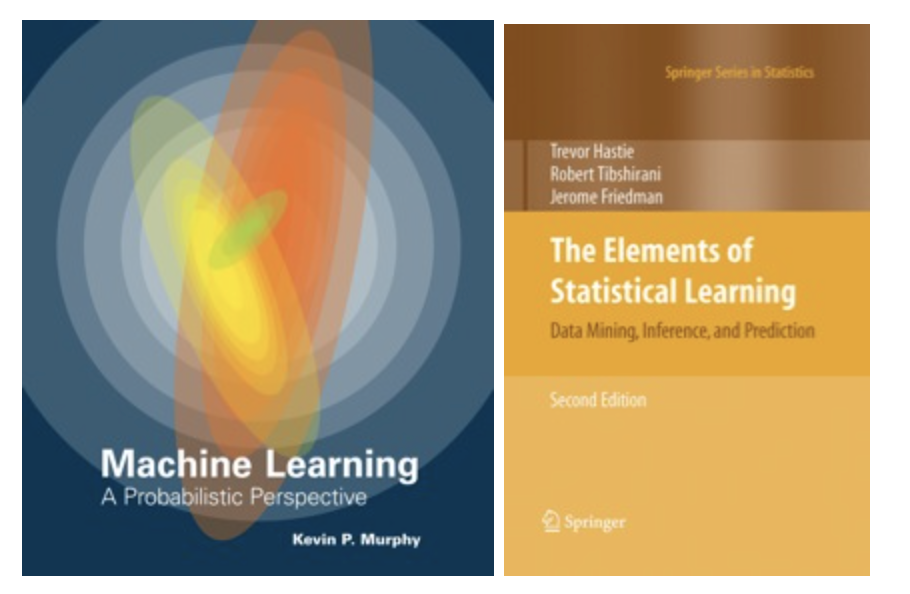

# cs4780-machine-learning

### Lectures

- [Overview (What is machine learning)](http://www.cs.cornell.edu/courses/cs4780/2017sp/lectures/lecturenote01_MLsetup.html)
- [k-nearest neighbors](http://www.cs.cornell.edu/courses/cs4780/2017sp/lectures/lecturenote02_kNN.html)
- [The Perceptron](http://www.cs.cornell.edu/courses/cs4780/2017sp/lectures/lecturenote03.html)
- [Estimating Probabilities from Data](http://www.cs.cornell.edu/courses/cs4780/2017sp/lectures/lecturenote04.html)
- [Naive Bayes](http://www.cs.cornell.edu/courses/cs4780/2017sp/lectures/lecturenote05.html)
- [Logistic Regression](http://www.cs.cornell.edu/courses/cs4780/2017sp/lectures/lecturenote06.html)
- [Gradient Descent](http://www.cs.cornell.edu/courses/cs4780/2017sp/lectures/lecturenote07.html)
- [Linear Regression](http://www.cs.cornell.edu/courses/cs4780/2017sp/lectures/lecturenote08.html)
- [Linear SVM](http://www.cs.cornell.edu/courses/cs4780/2017sp/lectures/lecturenote09.html)
- [Empirical Risk Minimization](http://www.cs.cornell.edu/courses/cs4780/2017sp/lectures/lecturenote10.html)
- [Bias / Variance Tradeoff](http://www.cs.cornell.edu/courses/cs4780/2017sp/lectures/lecturenote11.html)
- [ML Debugging, Over- / Underfitting](http://www.cs.cornell.edu/courses/cs4780/2017sp/lectures/lecturenote12.html)
- [Kernel Machines I](http://www.cs.cornell.edu/courses/cs4780/2017sp/lectures/lecturenote13.html)
- [Kernel Machines II](http://www.cs.cornell.edu/courses/cs4780/2017sp/lectures/lecturenote14.html)
- [Gaussian Processes / Bayesian Global Optimization](http://www.cs.cornell.edu/courses/cs4780/2017sp/lectures/lecturenote15.html)
- [Fast nearest neighbor search](http://www.cs.cornell.edu/courses/cs4780/2017sp/lectures/lecturenote16.html)
- [Decision / Regression Trees](http://www.cs.cornell.edu/courses/cs4780/2017sp/lectures/lecturenote17.html)
- [Bagging](http://www.cs.cornell.edu/courses/cs4780/2017sp/lectures/lecturenote18.html)
- [Boosting](http://www.cs.cornell.edu/courses/cs4780/2017sp/lectures/lecturenote19.html)
- [Deep Learning](lectures/lecturenote20.pdf) 

### Prerequisites

- Mathematical maturity and experience
- Students interested in preparing for the exam are advised to work through the first three weeks of [Andrew Ng's online course on machine learning](https://www.coursera.org/course/ml).

### Objective

The goal of this course is to give an introduction to the field of machine learning. The course will teach you basic skills to decide which learning algorithm to use for what problem, code up your own learning algorithm and evaluate and debug it.

### Abstract

The field of machine learning is concerned with the question of how to construct computer programs that automatically improve with experience. Recently, many successful machine learning applications have been developed, ranging from data-mining programs that learn to detect fraudulent credit card transactions, to information-filtering systems that learn users' reading preferences, to autonomous vehicles that learn to drive. There have also been important advances in the theory and algorithms that form the foundation of this field. This course will provide a broad introduction to the field of machine learning. Prerequisites: CSE 241 and sufficient mathematical maturity (Matrix Algebra, probability theory / statistics, multivariate calculus). There is no enrollment limit, but the instructor will hold a take-home placement exam (on basic mathematical knowledge) that is due on the first day of class.

### Textbook 

The main book is Kevin Murphy **Machine Learning A Probabilistic Perspective.** As reference book we will also use Hastie, Tibshirani, Friedman **The Elements of Statistical Learning.**

